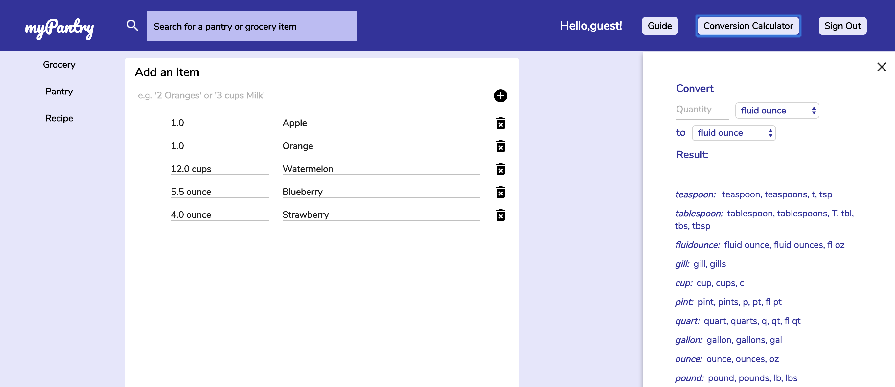
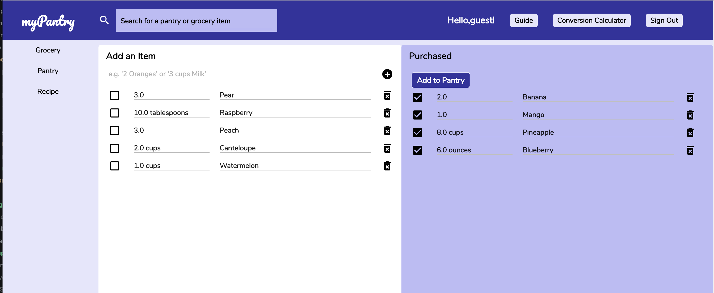

[myPantry](https://mypantry.herokuapp.com/#/) is a personal project by Miriam Lau.

myPantry is a web application for cooking enthusiasts. myPantry allows users to add items to their pantry and grocery, and update or delete items in their pantry and grocery. With a click of a checkbox or button, users can transfer groceries to purchase, and auto-update the pantry with purchased groceries. Users can add, update and delete recipes, and set reminders and their due dates.

## Features

#### Secure Authentication
- Users can create accounts or sign in to their accounts with secure authentication.

#### Pantry Items & Reminders
- Users can add, update and delete pantry items. Pantry items are organized by category.
- Users can add and delete reminders. Reminders are organized by due date.
- Recipes that have a "date to make" are also listed in the Reminder section.

#### Grocery Shopping List
- Users can add, update, and delete grocery items.
- Users can transfer groceries "Purchased" by clicking the checkbox and move purchased items to their Pantry by clicking the "Add to Pantry" button. Duplicate items with the same unit will be combined in the Pantry.

#### Favorite Recipes
- Users can add, update, and delete recipes.
- Clicking on a recipe image will take the user to that recipe's detail page.
- Users can choose a date to make the recipe.

#### Search
- Users can search for items in their grocery or pantry.

#### Conversion Calculator
- A calculator assists users in converting quantities to different measurement units.

#### User Guide
- A user guide (info icon in top navigation bar) provides information on how to use the application.

## Project Design
A [proposal](./docs/proposal/development_README.md) was drafted with an implementation timeline during the development process.

A [database schema](./docs/proposal/schema.md) was prepared in addition to the design proposal.

## Technology
myPantry is a single-page application implementing the Rails framework (backend) and the React library (frontend).
- [Backend Dependencies](./docs/backend_tech.md)
- [Frontend Dependencies](./docs/frontend_tech.md)

## Future Implementations
New features and future implementations are listed in this
[outline](./docs/future_implementations.md).
