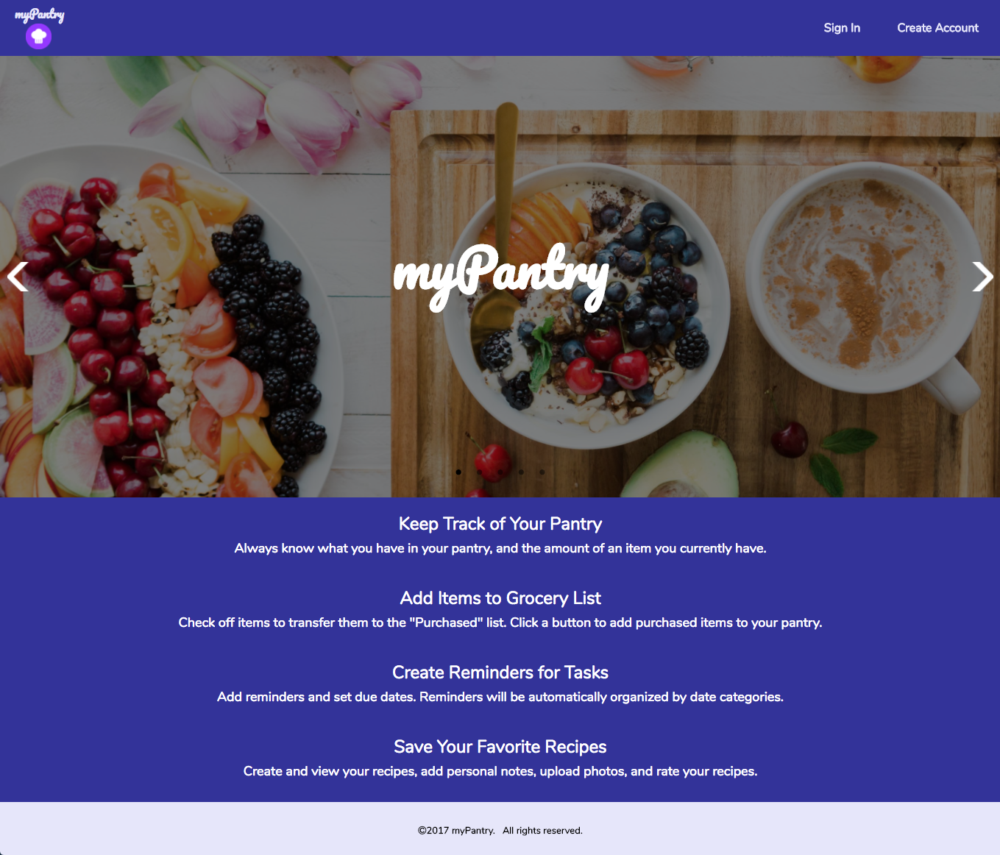
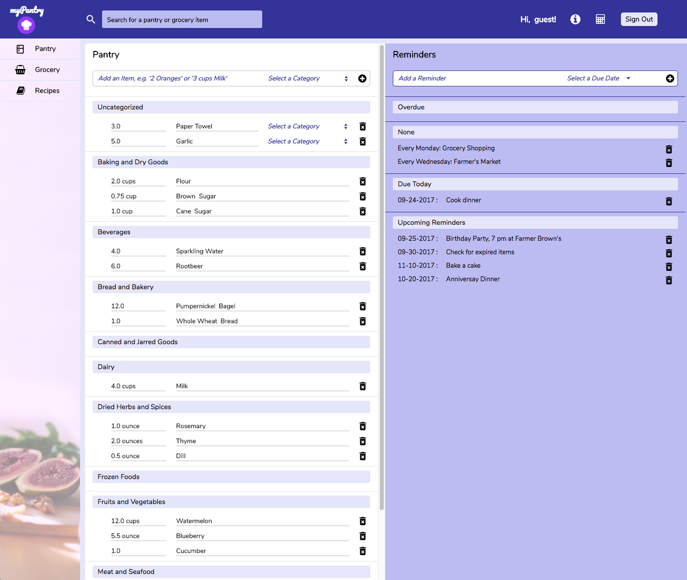
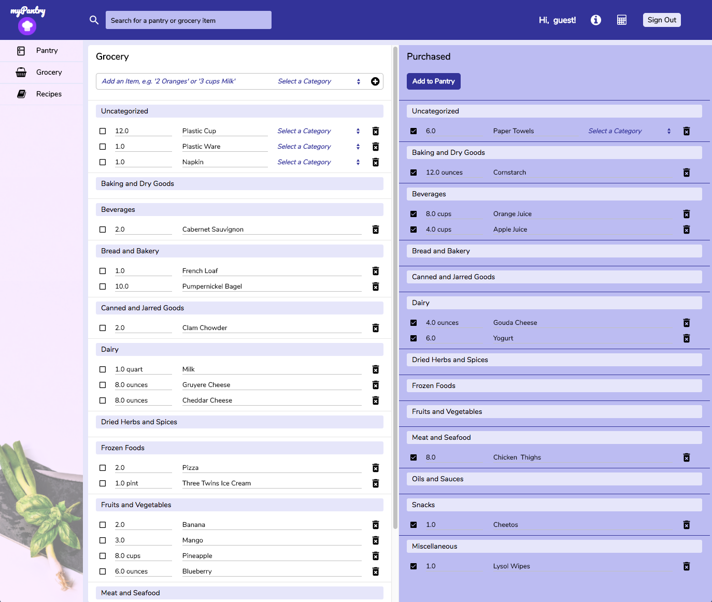
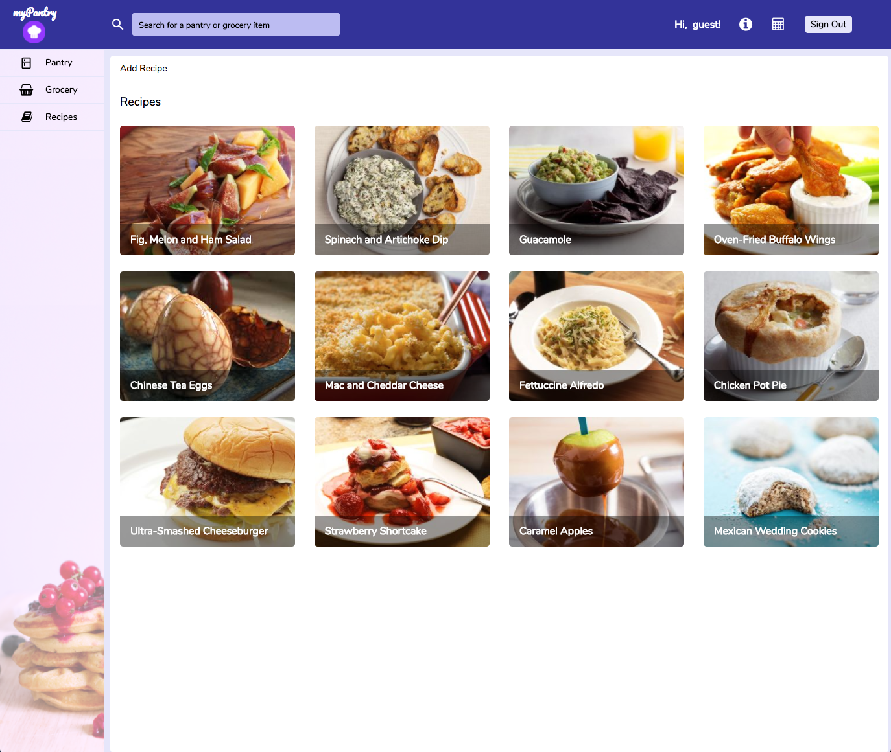
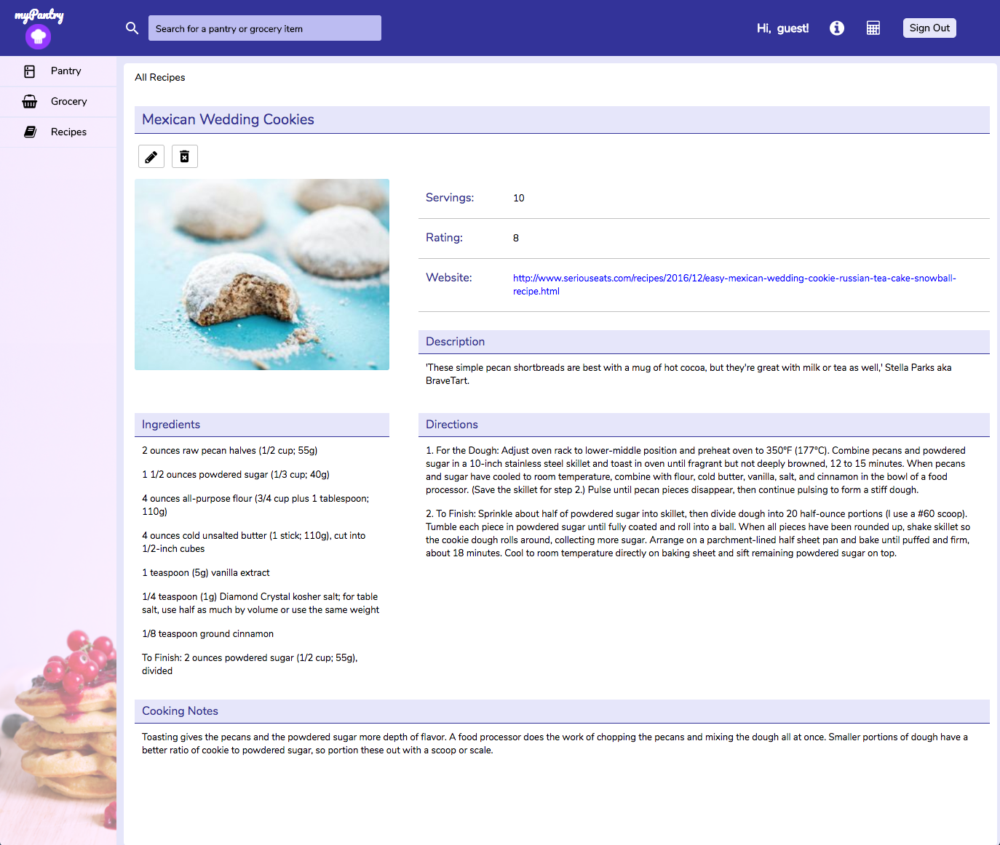

[myPantry](https://mypantry.herokuapp.com/#/) is a personal project by Miriam Lau.

## Summary

*myPantry* is a web application for cooking enthusiasts. *myPantry* allows users to keep track of their pantry items, and update their pantry after purchasing items from their grocery page. Users can also create a library of their favorite recipes, and use the reminders feature to keep track of daily or upcoming tasks.

## Features

### Secure Authentication
- Users can create accounts or sign in to their accounts with secure authentication.

### Pantry Items & Reminders
- Users can add, update and delete pantry items. Pantry items are organized by category.
- Users can add and delete reminders. Reminders are organized by date categories.

### Grocery Shopping List
- Users can add, update, and delete grocery items.
- Users can transfer groceries to "Purchased" by clicking the checkbox, and move purchased items to their Pantry by clicking the "Add to Pantry" button. Duplicate items with the same unit will be combined in the Pantry.

### Favorite Recipes
- Users can add, update, and delete recipes.
- The recipe index shows all the recipes a user has saved, and has a link to add a new recipe. Clicking on a recipe image will take the user to that recipe's detail page.
- A recipe detail page shows information about the recipe, and also allows users to update and delete the recipe.

### Features on Top Navigation bar

#### Search
- Users can search for items currently in their grocery and pantry.

#### User Guide
- A user guide provides information on how to use the application.

#### Conversion Calculator
- A calculator assists users in converting quantities to different measurement units.

## Project Design
- A [proposal](./docs/proposal/development_README.md) was drafted with an implementation timeline on the development process.
- [Wireframes](./docs/proposal/wireframe_doc.md) were created and used to convey the website design.
- A [database schema](./docs/proposal/schema.md) was prepared in addition to the design proposal.

## Technology
myPantry is a single-page application implementing the *Rails* framework (backend) and the *React* library (frontend).
- [Backend Dependencies](./docs/backend_tech.md)
- [Frontend Dependencies](./docs/frontend_tech.md)

## Future Implementations
New features and future implementations are listed in this
[outline](./docs/future_implementations.md).
